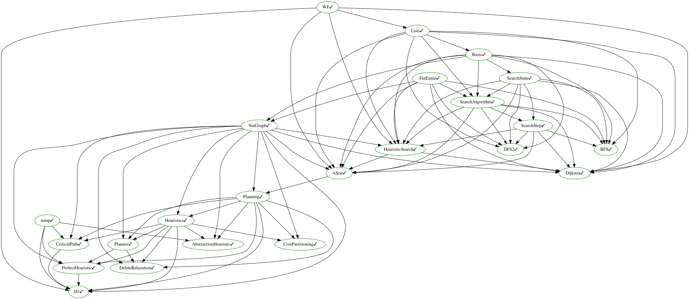

# Planning in Lean

We define various concepts related to heuristic search for planning in this repo.
As the basis, we use the [formalisation of STRIPS planning by A. Nicodemos](https://github.com/AmosNico/validator) and the [implementation of graph search algorithms in Lean](https://github.com/galvusdamor/lean4-search-algorithms).

We defined the notion of heuristics for planning problems and created a planner based on it. We also provide implementations of the following heuristics and proved that they are admissible:

- the perfect heuristic h^*
- the perfect delete-relaxation heuristic h^+
- the maximum / critical path of width 1 heuristic h^1
- abstraction heuristics in general
- pattern database heuristics (PDBs)

We also proved that non-negative cost partitionings of admissible heuristics are again admissible.

## Running the Planner
This repo contains an executable, but practically very inefficient planner.
To run it, you first need to obtain the input file that our planner can read.
For that, you need [Downward Certificates](https://github.com/salome-eriksson/downward-certificates).
You **must** check out the certificates branch. It contains a file [CERTIFICATEs.md](>https://github.com/salome-eriksson/downward-certificates/blob/certificates/CERTIFICATES.md) which contains instruction on how to build the planner. The last version for which we verified that it is working correctly is [f5f3f7dd7975cf59bcd8de81836a43d9ebdbe96f](https://github.com/salome-eriksson/downward-certificates/commit/f5f3f7dd7975cf59bcd8de81836a43d9ebdbe96f).

You can obtain benchmark instances in either the [AI Basel](github.com/aibasel/downward-benchmarks/) or [Planning Community](https://github.com/AI-Planning/classical-domains) repositories.
Then run
```
./fast-downward.py PROBLEM.pddl --search "astar(hmax(),verify_optimality=true)"
```

This will create a file ``task.txt`` which is the grounded STRIPS version of the selected problem. You need this as input for the
planner. All other files can be discarded.
The ``task.tex`` file used in [1] are located in the ``test`` directory.

To run the planner, you first need to build it. For this run ``lake build``.

We recommend to run the planner executable directly as:
```
    .lake/build/bin/planner INPUT-FILE HEURISTIC
```
``INPUT-FILE`` is the ``task.txt`` file you obtained before. With ``HEURISTIC`` you may select the heuristic to be used. Currently, we only expose the constant zero heuristic ``h0`` and the maximum heuristic ``h1``.

The planner will then either output that no plan exists or that it found one and then print the plan in IPC (International Planning Competition) format.

Note that the planner is currently extremely inefficient when it comes to runtime. I.e. it is able to solve some small toy examples, but will fail so solve any reasonably large planning problem, usually because it will exhaust memory.


## PDDL Front End

The `pddl` directory contains a parser for PDDL domain and problem files together with a
formal semantics of the lifted (schematic) representation, so that planning tasks can be
read in the standard input language instead of a custom grounded format.  It also contains
an executable, verified plan validator for that semantics, a verified grounder (both naive
full grounding and a delete-relaxation reachability grounder) and a translation of ground
tasks into the `STRIPS.PlanningTask` interface used by `planning`.  On top of these, the end
to end planner `PDDL.solveOutcomeOptimal` grounds a PDDL instance, compiles away conditional
effects (`pddl/Grounding/Unconditional.lean`), negative conditions
(`pddl/Grounding/Positive.lean`) and disjunctive goals (`pddl/Grounding/GoalSplit.lean`) —
each step proved to preserve plans, plan costs and solvability — translates the result to
`STRIPS.PlanningTask` and hands it to the A* search of `planning`
(`STRIPS.planner_heap_lazy_fast` of `planning/PlannerHeapLazy.lean`); it implements no search
of its own.  Because every step preserves plan costs and the search is optimal, the plan it
returns is proved to be of minimal cost among all plans of the instance
(`PDDL.solveOutcomeOptimal_optimal`).  With `--heur=NAME` the search is run with one of the admissible heuristics of
`planning` instead of the blind one (`PDDL.solveOutcomeWith` of
`pddl/Grounding/SolveHeur.lean`), which keeps both guarantees and the cost optimality of the
plans.  See
[pddl/README.md](pddl/README.md) for the supported fragment, the structure of the
development and the results that are proved.  The front end can be exercised with

```
lake build pddlparse
.lake/build/bin/pddlparse --roundtrip --check DOMAIN.pddl PROBLEM.pddl
.lake/build/bin/pddlparse --solve DOMAIN.pddl PROBLEM.pddl
.lake/build/bin/pddlparse --solve --heur=h1fast DOMAIN.pddl PROBLEM.pddl
.lake/build/bin/pddlparse --validate=PLAN.txt DOMAIN.pddl PROBLEM.pddl
```

The last line checks a plan file (one ground action per line, in IPC syntax) against the
instance with the verified validator `PDDL.validatePlanText` of `pddl/PlanFile.lean`: a plan
it accepts is proved to be a plan of the lifted semantics, a plan it rejects is proved not
to be one, and the cost it reports is the cost the semantics assigns to the plan.  That the
reader inverts the printer, so far only tested by round-tripping benchmark files, is now
proved at the s-expression level in `pddl/SexpRoundTrip.lean`.

The grounding is proved to preserve the semantics (plans, plan costs and solvability of the
ground task are exactly those of the lifted instance), and the planner is proved sound
(every plan it prints solves the lifted instance) and, when it reports unsolvability,
correct as well.  The `pddl` library depends on `planning` for the search; `planning` itself
does not depend on `pddl`.

### The searches

The A* searches of `SearchAlgorithms` are wired to `STRIPS.PlanningTask` in three files, each
of which proves that its planner returns *the same plan* as the reference planner
`STRIPS.planner`, so completeness and optimality transfer without new proofs:

| file | planner | search |
| --- | --- | --- |
| `planning/PlannerHeap.lean` | `STRIPS.planner_heap_fast` | leftist heap queue |
| `planning/PlannerHeapLazy.lean` | `STRIPS.planner_heap_lazy_fast` | heap with lazy deletion, linear-time path reconstruction |
| `planning/PlannerCached.lean` | `STRIPS.planner_cached` | the same, with a memoising heuristic |

All three run on the successor *generator* of the STRIPS task and are driven by the goal
*predicate*, so neither the `2^n` states nor the list of all goal states is ever built.  The
last two take an optional argument: if it is non-zero, the search prints a progress line on
stderr every that many expansions (`dbg_trace` is the identity, so no result depends on it).

Which one to use depends on the heuristic.  With an expensive heuristic the search spends its
time evaluating it — a heap operation costs `O(log m)` evaluations — and caching is what
matters: on `test/gripper-p01.txt` with `h1`, the three take 13.7 s, 15.9 s and **1.2 s**, and
on `test/miconic-s4-0.txt` 123 s, 166 s and **4.3 s** (same plan in every case).  With the
blind heuristic the cache is pure overhead and the uncached searches are the better choice;
that is what the PDDL front end uses.

### Faster implementations of the heuristics

The definitions of `h^1` and of LM-cut are written for the correctness proofs, not for
speed: `STRIPS.h_1_step` recomputes the precondition and add lists of every action for every
variable in every sweep, and `STRIPS.h1_pcf` computes a complete `h^1` fixpoint for every
precondition of every action.  Two modules therefore provide implementations that compute the
*same values*, each proved equal to the original so that no admissibility proof had to be
redone:

| file | definition | result |
| --- | --- | --- |
| `planning/H1Fast.lean` | `STRIPS.h_1_fast` | `STRIPS.h_1_fast_eq : h_1_fast prob s = h_1 prob s` |
| `planning/LMCutFast.lean` | `STRIPS.lmcut_fast` | `STRIPS.lmcut_fast_eq : lmcut_fast prob s = lmcut prob s h1_pcf` |

Two more, in `planning/LandmarkCutting.lean`, replace the *implementation* of a definition
without touching it, by proving the fast version equal and installing it with `@[csimp]`:
`STRIPS.justification_graph_fast` answers an adjacency query of the justification graph with a
single bit test, from buckets of actions and unions of add lists extracted once per graph
(`STRIPS.justification_graph_eq_fast`), and `STRIPS.goal_zone_fast` computes the goal zone by
one backward closure over the zero-cost edges instead of one A* per fact
(`STRIPS.goal_zone_eq_fast`).  Together they make one LM-cut evaluation about two orders of
magnitude cheaper (`bench/README.md` has the measurements); LM-cut is nevertheless still too
expensive per state to compete with blind search on the benchmarks.

`planning/SuccIndex.lean` and `planning/PlannerFast.lean` do the same for the state space:
the cost of a transition is read off a precomputed index from facts to the actions that add
or delete them (`STRIPS.cost_of_fast`, `STRIPS.cost_of_fast_eq`), instead of scanning all
actions, and `STRIPS.planner_cached_fast` is the memoising A* run on that transition system,
again proved to return the same plan as the reference planner
(`STRIPS.planner_cached_fast_eq_planner`).

`bench/run-bench.sh` runs the PDDL front end over a list of IPC domains with a choice of
heuristics; `bench/README.md` describes it and reports a run over 409 problems.

The `planner` executable selects heuristic and search on the command line:

```
lake build planner
.lake/build/bin/planner TASK.txt [h1|h0] [cached|lazy|heap] [trace-every]
```

The other thing a search spends its time on is the state space itself.  `STRIPS.satisfies'`
— the goal test and, through `applicable'`, every applicability test — is defined by
enumerating the variables of the condition, and that enumeration builds and filters a list of
all `n` variables on *every* call.  `planning/Planning.lean` therefore also provides the
bit-parallel `STRIPS.satisfies'_fast` (one bitwise `and` and one comparison), proved equal to
it (`STRIPS.satisfies'_eq_fast`) and installed with `@[csimp]`, so the compiler uses it
everywhere and no statement about `satisfies'` changes.  On the gripper instances of the
aibasel benchmarks this alone is worth two orders of magnitude of search time.

## Dependency Graph



(Update this graph with `make dependencies.svg`.)

## References
If you want to cite this work, please cite [1]

```
[1] Behnke, G., Kilian, S., Gattinger M. (2026).
A^* with h^max Definitely Finds Optimal Plans -- Formally Verifying a Planner Based on Heuristic Search.
Heuristics and Search for Domain-independent Planning (HSDIP 2026)
```
